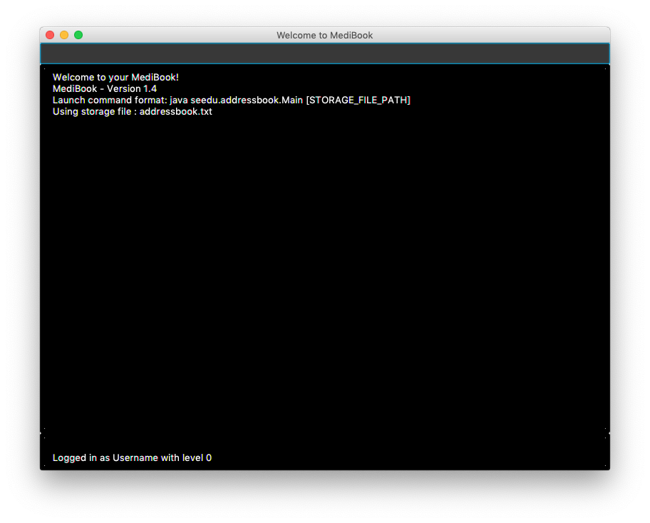

= JitHub

* JitHub is a CLI (Command Line Interface) Address Book application. It has a very basic GUI.
* It is a Java application intended for busy students to schedule their meetings and view their calenders by entering natural language commands.

*What's different from other addressbooks?*

* Humours are added in JitHub.
* Users can manage their contacts in JitHub.
* Users can schedule meetings in JitHub.
* Users can view their calender on JitHub

*Useful Links*

* <<UserGuide#, User Guide>>
* <<DeveloperGuide#, Developer Guide>>

== Contributors

* The current JitHub developers can be found at https://github.com/CS2113-AY1819S1-W12-1/main/blob/master/docs/AboutUs.adoc[here].
* The full list of the original addressbook contributors for se-edu can be found https://se-edu.github.io/Team.html[here].

== Acknowledgements

* Some parts of this sample application was inspired by the excellent http://code.makery.ch/library/javafx-8-tutorial/[Java FX tutorial] by Marco Jakob.
* Stack Overflow
* NUS School of Computing

== Contact Us

* *Bug reports, Suggestions* : Post in our https://github.com/CS2113-AY1819S1-W12-1/main/issues[issue tracker]
if you noticed bugs or have suggestions on how to improve.
* *Contributing* : We welcome pull requests. Follow the process described https://github.com/oss-generic/process[here].
